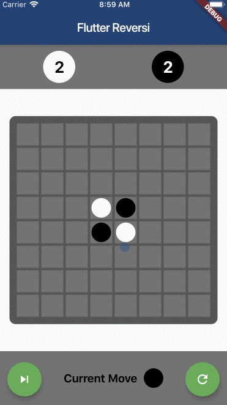
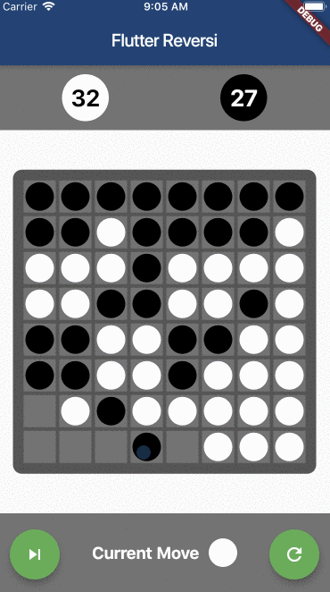

# Feversi
A Reversi application that covers the basics of cross-platform development using [Flutter](https://flutter.dev/) and [Dart](https://dart.dev/).

## Preview

## Remarks
- Building animations using [AnimatedBuilder](https://api.flutter.dev/flutter/widgets/AnimatedBuilder-class.html)
- Controlling element visibility using both [Visibility](https://api.flutter.dev/flutter/widgets/Visibility-class.html) and `collection if`
- Creating custom widgets
- Creating custom color swatches. Further explanations can be found in [this article on Medium](https://medium.com/@nickysong/creating-a-custom-color-swatch-in-flutter-554bcdcb27f3) 🍻
- Adding more than one [FloatingActionButton](https://api.flutter.dev/flutter/material/FloatingActionButton-class.html)s in [Scaffold](https://api.flutter.dev/flutter/material/Scaffold-class.html). More like a hack tho.
- Responsive element & font sizes across different types of mobile devices
- Most efficient handling of application constants in Flutter

## Any concerns or motivations?
Make sure to report any issues/bugs/concerns if you find one. Or, create a PR directly through GitHub portal we all know and love. 💖 I am totally broke but you don't have to donate nothing. 😎
